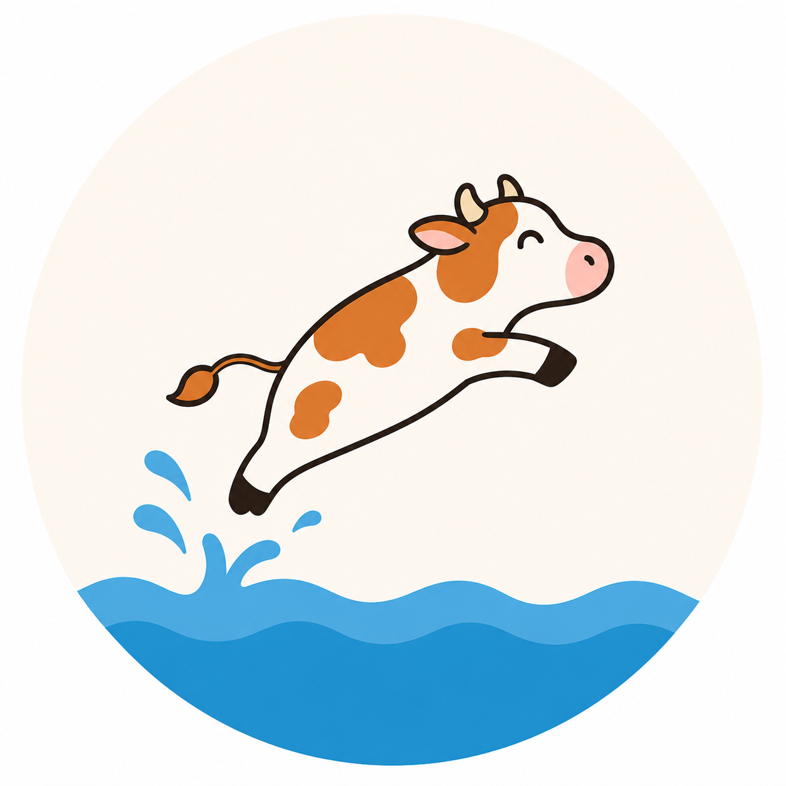

# DieFliegendeKuh — тренажёр и словарь: неправильные глаголы (все 270)

Интерактивное HTML-приложение — **все глаголы №1–270**.
Файл: `DieFliegendeKuhApp.html`.

Вверху — переключатель языка интерфейса **RUS/ENG** и три вкладки: **🎯 Тренажёр**, **📖 Словарь** и **🗂️ Учить**.

## Статусы глагола (общие для всех вкладок)
Единый прогресс на все 270 глаголов, 4 статуса: 📘 Новое (по умолчанию) → 🟡 Повторено (свайп вправо в «Учить») / 📕 Невыученное (свайп влево в «Учить» или ошибка в Тренажёре) → 📗 Выучено (только правильный ответ в Тренажёре). 🟡 — это самооценка, такие глаголы остаются в пуле Тренажёра наравне с 📘/📕, пока не подтверждены текстовым вводом.

## Вкладка «Тренажёр»
- **Перед каждым тестом обязательно выбирается диапазон глаголов** («от … до», числами или пресетами по 35: 1–35 … «Все 1–270»). Старт заблокирован, пока диапазон некорректен.
- Инфинитив (напр. `abbrechen`) → ввести **перевод** (на русский или английский — в зависимости от выбранного языка интерфейса) и **Perfekt** со вспомогательным глаголом (`hat abgebrochen`).
- Перевод сверяется мягко (по корню) + кнопка «засчитать/ошибка»; Perfekt — строго, включая `hat`/`ist`; принимаются варианты (angewendet/angewandt, gesandt/gesendet, модальные, hat/ist getreten) и умлауты как ae/oe/ue/ss.
- В конце — **разбор ошибок** таблицей «твой ответ vs правильный».
- Папки 📗 Выучено / 📕 Невыучено / 🟡 Повторено / 📘 Новые; режимы: весь диапазон / новые+невыученные+повторённые / только невыученные / только повторённые / только выученные (счётчики внутри диапазона).
- Автосохранение в браузере + Экспорт/Импорт JSON. **Имя файла экспорта содержит дату и время**: `verben_progress_ГГГГ-ММ-ДД_ЧЧ-ММ-СС.json`.

## Вкладка «Словарь»
- Листаемая таблица всех 270 глаголов для повторения перед тестом.
- По каждому глаголу: №, инфинитив (+подсказка для омонимов), **Präsens · Präteritum**, **Perfekt** (цвет по `hat`/`ist`), перевод, статус-папка.
- Поиск по номеру / инфинитиву / переводу / Perfekt; фильтры: Все / В диапазоне / 📗 / 📕 / 🟡 / 📘; перемещение глагола между папками прямо из таблицы.
- **Режим самопроверки**: «Скрыть перевод» и «Скрыть Perfekt» размывают ячейки, клик по ячейке открывает ответ.

## Вкладка «Учить» — карточки в стиле Tinder
- Экран настройки: диапазон глаголов + фильтр по статусу (чекбоксы 📘/📕/🟡/📗, по умолчанию все включены). Настройки помнятся, пока открыта страница.
- Карточка листается тапом по 3 состояниям: 1) инфинитив + формы (Präsens · Präteritum · Perfekt) на размытой иллюстрации, 2) перевод вместо форм, 3) чистая иллюстрация без блюра + пример предложения на немецком.
- Свайп вправо/влево (или клавиши ←/→) — для новых (📘) глаголов ставит 🟡 «Повторено» или 📕 «Невыученное»; для остальных статусов просто листает дальше без изменений. Колода зациклена, счётчика «осталось» нет.
- Иллюстрации — `.webp`, ~800×1200 px, отдельные файлы в папке `verb-images/001.webp` … `270.webp` (номер = № глагола), подбираются вручную и не входят в репозиторий; без файла карточка показывает нейтральную заглушку.

## Проверено
Автотесты: все 270 записей — перевод и все формы Perfekt засчитываются; Präsens/Präteritum распарсены без ошибок. Headless-браузер (Playwright): навигация по всем трём вкладкам, словарь (поиск, скрытие, перемещение по папкам, фильтр 🟡), режимы Тренажёра (все 5, включая «только повторённые») и полный цикл карточек «Учить» (все 3 состояния по тапу, свайп/стрелки, зацикливание колоды, правило «свайп меняет статус только у 📘 новых», заглушка при отсутствии иллюстрации) работают без ошибок в консоли.

## Лицензия
[CC BY-NC 4.0](https://creativecommons.org/licenses/by-nc/4.0/) — некоммерческое использование, с обязательным указанием авторства (kiselkath). См. файл [LICENSE](LICENSE).